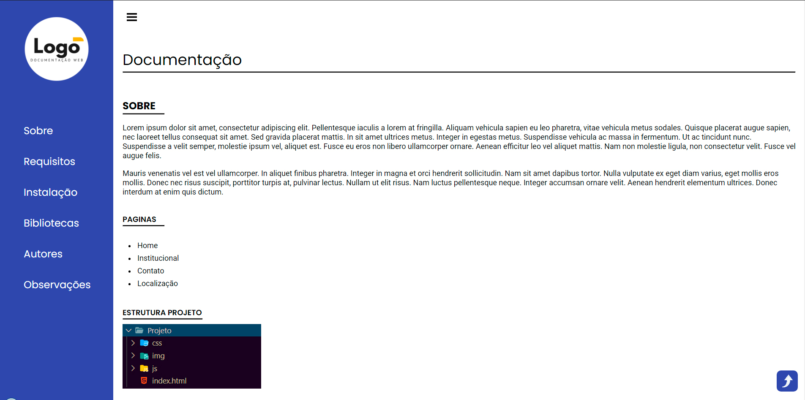

<h1 align="center">  Documentação Simples</h1>

    

Criação da template DOC para ser usada como forma de documentação de projetos de software de diferentes linguagens.  

## Descrição

O objetivo desse projeto é oferecer um modelo simples de documentação de sistemas e sites para ajudar desenvolvedores. Dessa forma fica fácil transmitir informações relevantes para outros programadores que possam utiliza o seu software. Informações como instalação detalhada, sobre o que é o projeto, Requisitos para ele funcionar etc. Para isso basta fazer uma cópia do projeto e alterar as informações contidas nele para as suas e por último coloque os arquivos em uma pasta doc em seu projeto.

## Construído com

* [HTML](https://www.w3schools.com/html/) - HTML abreviação para a expressão inglesa HyperText Markup Language, que significa: "Linguagem de Marcação de Hipertexto" é uma linguagem de marcação utilizada na construção de páginas na Web. Documentos HTML podem ser interpretados por navegadores. A tecnologia é fruto da junção entre os padrões HyTime e SGML.

* [CSS](https://www.w3schools.com/css/default.asp) - Cascading Style Sheets é um mecanismo para adicionar estilo a um documento web. O código CSS pode ser aplicado diretamente nas tags ou ficar contido dentro das tags "style". Também é possível, em vez de colocar a formatação dentro do documento, criar um link para um arquivo CSS que contém os estilos.

* [JAVASCRIPT](https://www.w3schools.com/js/default.asp) - JavaScript é uma linguagem de programação interpretada estruturada, de script em alto nível com tipagem dinâmica fraca e multiparadigma. Juntamente com HTML e CSS, o JavaScript é uma das três principais tecnologias da World Wide Web.

* [FIGMA](https://www.figma.com/) - Figma é um editor gráfico de vetor e prototipagem de projetos de design baseado principalmente no navegador web, com ferramentas offline adicionais para aplicações desktop para GNU/Linux, macOS e Windows..

## Autor

* **Cesar dos Santos de Almeida** - *responsável pela construção, desenvolvimento e criação do layout*

## Licença
Este projeto está licenciado sob a licença MIT - consulte o arquivo  [LICENSE.md](LICENSE.md) para obter detalhes

## Links
* [Demo](https://cesar959.github.io/doc-simples/) - link da demonstração online.
* [Layout](https://www.figma.com/file/y0Bpbbe8qWJFUbRzfAJX78/Documenta%C3%A7%C3%A3o-Simples) - link do Figma,  aonde foi feito o layout.
